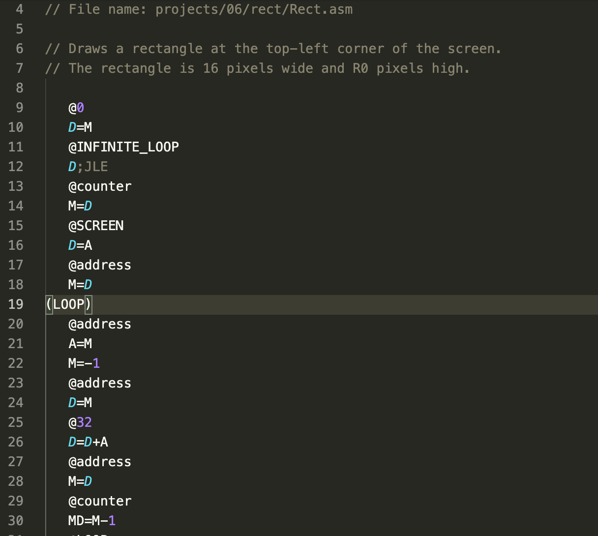
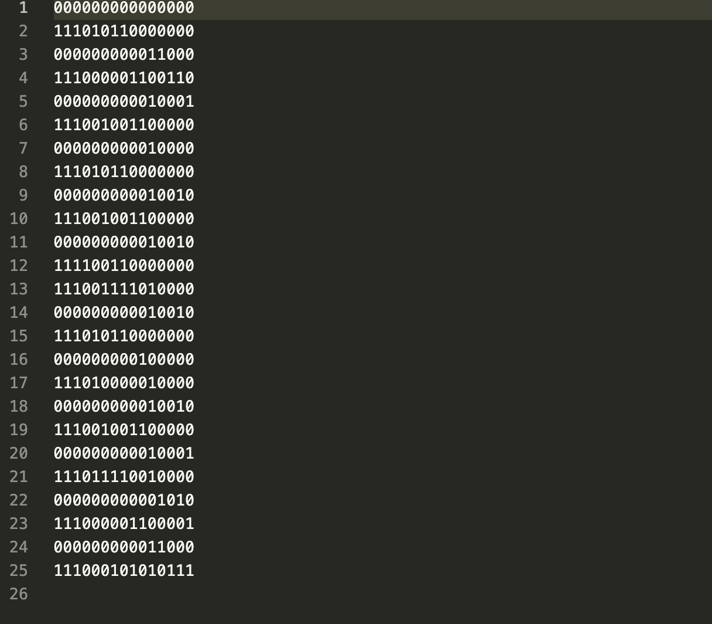
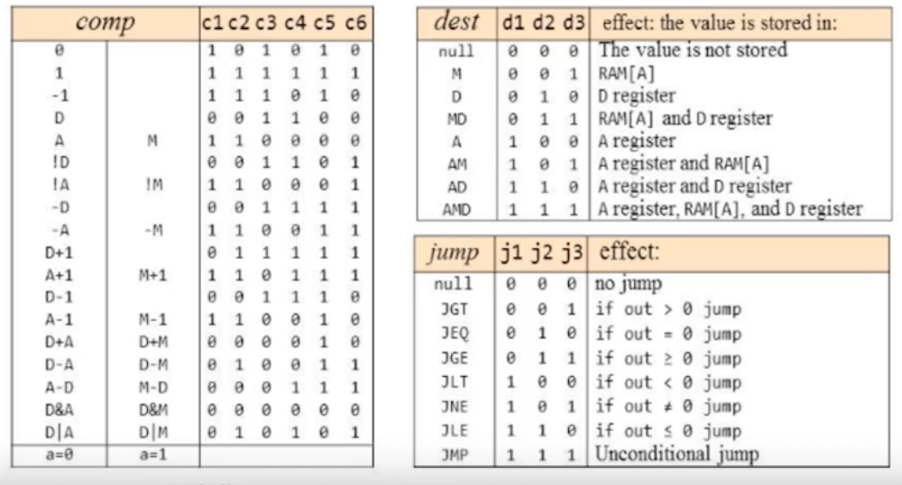

## Assembler of HACK Machine Language, featured in nand2tetris course.

Handles labels (jump references), variables, direct register accessing and so on.

Usage: 
- `./compile.sh` to compile after the changes to some file were made
- `./compileHACK.out rect/Rect.asm ` to compile the fact (in this example `rect/Rect.asm` is compiled).

### Examples's source code:

### Example's compiled code:

### Hack Machine Language
Hack Machine Language - 16-bit Turing complete machine language that supports two types of commands:
- A command, that features loading address in A (address register of Hack CPU) registers and simultaniosuly accesses M register (memory register of Hack CPU).
- B command, that allows to perform arithmetical and logical operations on register's data, as well as handles different jump conditions (that are supported in hardware). To convert B commands uses such mapping:

If you want to get more info on that, consider reading https://www.csie.ntu.edu.tw/~cyy/courses/introCS/20fall/lectures/handouts/lec08_HackML.pdf
